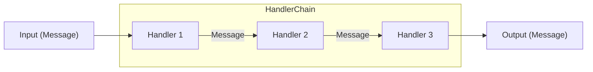

# Interact
A simple python library to interact and build applications with Large Language Models.

## Core Concept


`Interact` has three main components / assumptions:

* Entities in an application communicate through `Message`s.
* `Message`s are passed through `Handler`s that can modify (transform, format, etc.) the `Message`.
* `Handler`s are chained together to form a `HandlerChain`. `HandlerChain`s hold a sequence of `Handler`s that are executed in order.

## Installation
```bash
pip install git+https://github.com/pritam-dey3/interact
```

## Example Usage
```python
import asyncio

from dotenv import load_dotenv

from interact import HandlerChain, Message, handler
from interact.handlers import OpenAiLLM

load_dotenv()  # load openai api key from .env file


@handler
async def company_name(msg: Message, chain: HandlerChain) -> str:
    chain.variables["product"] = msg.primary
    return (
        f"What would be an appropriate name for a business specializing in {msg.primary}?"
        "Only mention the company name and nothing else."
    )


@handler
async def company_tagline(msg: Message, chain: HandlerChain) -> str:
    return (
        f"What would be an appropriate tagline for a business specializing in {chain.variables['product']}"
        f" and with company name {msg.primary}?\nFormat your output in the following"
        f" format:\n{msg.primary}: <tagline>"
    )


def main():
    name_and_tagline_generator = (
        company_name_prompt >> OpenAiLLM() >> company_tagline_prompt >> OpenAiLLM()
    )

    res = asyncio.run(name_and_tagline_generator("bike"))
    print(res)


if __name__ == "__main__":
    main() # Socket: The best socks in the world

```

## Why Interact?
Applications with Large Language Models can get complex very quickly. You need more customizability and control over the prompts and their execution to satisfactorily build an application.

`Interact` was created with simplicity and scalability in mind. The core concepts of `Message`s, `Handler`s, and `HandlerChain`s are simple to understand and gives _You_ the power to build complex applications with ease.

More popular alternatives like `langchain` gets frustrating to use when you want to customize either the process or the prompts according to your needs. `Interact` gives you the control while maintaining a very simple and intuitive API.

